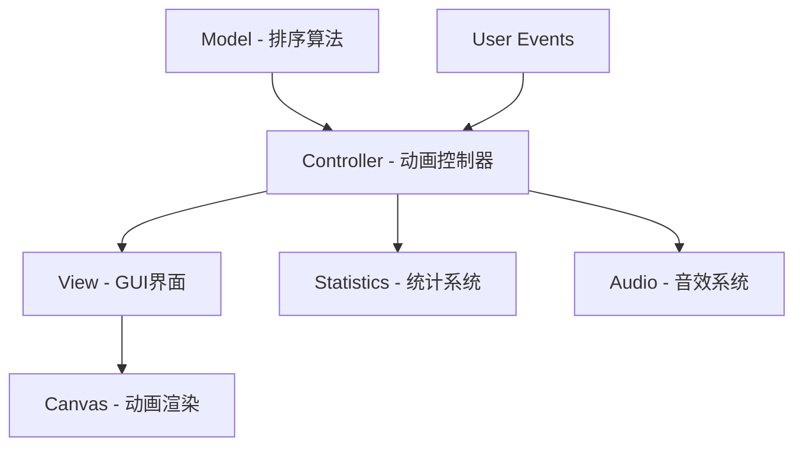

# 小鸭子冒泡排序可视化动画项目 - 架构设计文档

## 项目概述

本项目是一个使用Python + Tkinter开发的冒泡排序可视化动画教学工具。通过12只不同大小的小鸭子和一只大母鸭的动画演示，帮助用户直观理解冒泡排序算法的工作原理。

## 技术选型分析

### 选择Python + Tkinter的理由

**优势：**

- **内置库**：Tkinter是Python标准库的一部分，无需额外安装依赖
- **跨平台**：支持Windows、macOS和Linux系统
- **轻量级**：适合创建简单的GUI应用程序
- **动画支持**：通过Canvas组件可以实现流畅的动画效果
- **事件处理**：完善的事件绑定机制，适合交互式应用

**限制及解决方案：**

- **外观较简单**：通过自定义绘制和颜色方案弥补
- **性能限制**：优化动画算法，只重绘变化部分
- **图形能力有限**：使用基本图形组合创建复杂的鸭子形象

## 系统架构设计

### 整体架构模式

采用**MVC（Model-View-Controller）模式**结合**观察者模式**：



### 核心模块结构

#### 1. 主应用模块 (`main.py`, `duck_bubble_sort.py`)

- **职责**：应用程序入口点，初始化和协调各模块
- **关键类**：`DuckBubbleSortApp`
- **主要功能**：
  - 创建Tkinter主窗口
  - 初始化各个子系统
  - 处理应用程序生命周期

#### 2. 图形界面模块 (`gui/`)

- **职责**：管理用户界面布局和交互
- **关键类**：
  - `MainWindow` - 主窗口布局
  - `CanvasView` - 画布视图管理
  - `ControlPanel` - 控制面板组件
  - `StatsPanel` - 统计信息面板
- **主要功能**：
  - 响应式布局设计
  - 用户交互事件处理
  - 视觉效果展示

#### 3. 鸭子实体模块 (`entities/`)

- **职责**：表示和管理鸭子对象
- **关键类**：
  - `Duck` - 小鸭子类
  - `MotherDuck` - 大母鸭类
  - `DuckRenderer` - 鸭子图形渲染器
- **主要功能**：
  - 鸭子属性管理（大小、位置、状态）
  - 鸭子图形绘制
  - 动画状态管理

#### 4. 排序算法模块 (`algorithms/`)

- **职责**：实现冒泡排序算法和动画集成
- **关键类**：
  - `BubbleSort` - 冒泡排序算法
  - `SortAnimator` - 排序动画控制器
  - `SortState` - 排序状态数据结构
- **主要功能**：
  - 生成器模式的排序算法
  - 算法状态跟踪
  - 动画指令生成

#### 5. 动画系统模块 (`animation/`)

- **职责**：管理所有动画效果
- **关键类**：
  - `AnimationEngine` - 动画引擎
  - `Transition` - 过渡动画效果
  - `Timing` - 时间控制管理
  - `AnimationQueue` - 动画队列管理
- **主要功能**：
  - 动画调度和执行
  - 过渡效果实现
  - 时间和速度控制

#### 6. 音频系统模块 (`audio/`)

- **职责**：管理声音效果
- **关键类**：
  - `SoundManager` - 声音效果管理器
  - `SoundEffects` - 具体音效定义
- **主要功能**：
  - 音效加载和播放
  - 音量控制
  - 音效触发管理

#### 7. 统计系统模块 (`statistics/`)

- **职责**：收集和显示统计信息
- **关键类**：
  - `StatsTracker` - 统计数据跟踪器
  - `StatsDisplay` - 统计信息显示
  - `HistoryManager` - 历史记录管理
- **主要功能**：
  - 实时数据收集
  - 统计信息可视化
  - 历史记录管理

## 核心设计决策

### 1. 鸭子图形表示方案

**小鸭子设计：**

- 基本形状：椭圆形身体、圆形头部、三角形嘴巴
- 大小变化：20px-50px高度，表示不同数值
- 动画状态：静止、比较、移动、交换四种状态

**大母鸭设计：**

- 比小鸭子大1.5倍，深黄色系
- 添加皇冠或帽子表示身份
- 丰富的动画行为：移动、指向、点头、推动

**实现技术：**

- 使用Tkinter Canvas基本图形组合
- 每只鸭子作为Canvas组管理
- 通过坐标变换实现动画

### 2. 冒泡排序算法与动画集成

**算法可视化策略：**

```python
def bubble_sort_animated(arr):
    n = len(arr)
    for i in range(n):
        for j in range(0, n-i-1):
            # 比较操作 - 触发比较动画
            yield SortState(
                array=arr,
                comparing=[j, j+1],
                operation='compare'
            )
            
            if arr[j] > arr[j+1]:
                # 交换操作 - 触发交换动画
                arr[j], arr[j+1] = arr[j+1], arr[j]
                yield SortState(
                    array=arr,
                    swapping=[j, j+1],
                    operation='swap'
                )
```

**动画映射机制：**

- 比较操作 → 大母鸭移动到两个小鸭子中间
- 交换操作 → 两个小鸭子位置交换动画
- 完成标记 → 已排序小鸭子添加特殊效果

### 3. 动画控制系统

**状态管理：**

```python
class PlayState(Enum):
    STOPPED = "stopped"
    PLAYING = "playing"
    PAUSED = "paused"
    STEP_MODE = "step"
```

**控制功能：**

- 播放/暂停：状态切换和动画调度
- 重置：重新初始化排序算法
- 速度调节：0.5x-3x速度控制
- 单步执行：逐步执行算法

**用户交互：**

- 键盘快捷键支持（空格、R、S、↑↓）
- 视觉反馈和状态指示
- 响应式控制面板

### 4. 统计信息显示系统

**统计指标：**

- 基础指标：比较次数、交换次数、当前轮次
- 效率指标：比较速率、交换速率、算法进度
- 历史记录：最佳记录、平均表现

**显示设计：**

- 主统计面板：实时数据展示
- 性能指标面板：效率分析
- 实时图表：可视化趋势

### 5. 声音效果系统

**音效类型：**

- 动作音效：比较、交换、完成音效
- 界面音效：按钮点击、速度调节
- 背景音效：池塘环境音、鸭子叫声

**实现技术：**

- 使用pygame.mixer作为主要音频库
- 预加载音效文件
- 事件驱动的音效触发

## 项目文件结构

```
duck_bubble_sort/
├── main.py                     # 应用程序入口点
├── requirements.txt            # 项目依赖
├── README.md                   # 项目说明文档
├── config.py                   # 配置文件
├── duck_bubble_sort.py         # 主应用程序类
│
├── gui/                        # 图形界面模块
│   ├── __init__.py
│   ├── main_window.py          # 主窗口类
│   ├── canvas_view.py          # 画布视图管理
│   ├── control_panel.py        # 控制面板组件
│   ├── stats_panel.py          # 统计信息面板
│   └── styles.py               # 界面样式定义
│
├── entities/                   # 鸭子实体模块
│   ├── __init__.py
│   ├── duck.py                 # 小鸭子类
│   ├── mother_duck.py          # 大母鸭类
│   └── duck_renderer.py        # 鸭子图形渲染器
│
├── algorithms/                 # 排序算法模块
│   ├── __init__.py
│   ├── bubble_sort.py          # 冒泡排序算法
│   ├── sort_animator.py        # 排序动画控制器
│   └── sort_state.py           # 排序状态数据结构
│
├── animation/                  # 动画系统模块
│   ├── __init__.py
│   ├── animation_engine.py     # 动画引擎
│   ├── transition.py           # 过渡动画效果
│   ├── timing.py               # 时间控制管理
│   └── animation_queue.py      # 动画队列管理
│
├── audio/                      # 音频系统模块
│   ├── __init__.py
│   ├── sound_manager.py        # 声音效果管理器
│   ├── sound_effects.py        # 具体音效定义
│   └── audio_config.py         # 音频配置
│
├── statistics/                 # 统计系统模块
│   ├── __init__.py
│   ├── stats_tracker.py        # 统计数据跟踪器
│   ├── stats_display.py        # 统计信息显示
│   └── history_manager.py      # 历史记录管理
│
├── utils/                      # 工具模块
│   ├── __init__.py
│   ├── constants.py            # 常量定义
│   ├── helpers.py              # 辅助函数
│   └── file_manager.py         # 文件操作管理
│
├── assets/                     # 资源文件
│   ├── sounds/                 # 音效文件
│   ├── images/                 # 图片资源
│   └── fonts/                  # 字体文件
│
├── data/                       # 数据文件
│   ├── stats_history.json      # 统计历史数据
│   ├── user_settings.json      # 用户设置
│   └── best_records.json       # 最佳记录
│
├── tests/                      # 测试文件
│   ├── __init__.py
│   ├── test_bubble_sort.py     # 排序算法测试
│   ├── test_animation.py       # 动画系统测试
│   └── test_statistics.py      # 统计系统测试
│
└── docs/                       # 文档目录
    ├── architecture.md         # 架构文档
    ├── api_reference.md        # API参考
    └── user_guide.md           # 用户指南
```

## 性能优化策略

### 1. 动画性能优化

- **选择性重绘**：只重绘变化的鸭子对象
- **Canvas移动命令**：使用`move()`而非重绘整个对象
- **动画预计算**：预先计算动画路径和关键帧

### 2. 内存管理

- **对象池**：复用鸭子图形对象
- **延迟加载**：按需加载音效和资源
- **垃圾回收**：及时清理不再使用的对象

### 3. 响应性优化

- **异步操作**：使用Tkinter的`after()`方法
- **事件队列**：合理管理事件处理顺序
- **批处理更新**：合并多个小的更新操作

## 扩展性设计

### 1. 算法扩展

- **策略模式**：支持添加其他排序算法
- **插件架构**：算法作为独立插件
- **配置驱动**：通过配置文件选择算法

### 2. 主题扩展

- **主题系统**：支持不同的视觉主题
- **角色系统**：可替换的动画角色
- **国际化**：多语言支持

### 3. 功能扩展

- **教学模式**：分步骤的教学模式
- **挑战模式**：排序速度挑战
- **自定义数据**：用户自定义排序数据

## 测试策略

### 1. 单元测试

- **算法测试**：验证排序算法正确性
- **动画测试**：测试动画系统功能
- **统计测试**：验证统计数据准确性

### 2. 集成测试

- **模块交互**：测试模块间协作
- **用户界面**：测试用户交互流程
- **性能测试**：验证性能指标

### 3. 用户测试

- **可用性测试**：用户体验评估
- **教学效果**：教学价值验证
- **兼容性测试**：跨平台兼容性

## 部署和维护

### 1. 打包分发

- **PyInstaller**：创建独立可执行文件
- **依赖管理**：requirements.txt管理依赖
- **版本控制**：语义化版本号

### 2. 配置管理

- **用户设置**：个性化配置保存
- **默认配置**：合理的默认参数
- **配置迁移**：版本升级时的配置兼容

### 3. 错误处理

- **异常捕获**：优雅的错误处理
- **日志记录**：详细的运行日志
- **用户反馈**：错误报告机制

## 总结

本架构设计采用模块化、可扩展的设计理念，通过清晰的职责分离和标准化的接口设计，确保项目的可维护性和可扩展性。使用Python + Tkinter技术栈能够在满足功能需求的同时，保持项目的轻量级和跨平台特性。

通过精心设计的动画系统和用户交互，本项目将不仅是一个排序算法的可视化工具，更是一个生动有趣的教学辅助软件，能够帮助用户更好地理解和掌握冒泡排序算法的原理。
